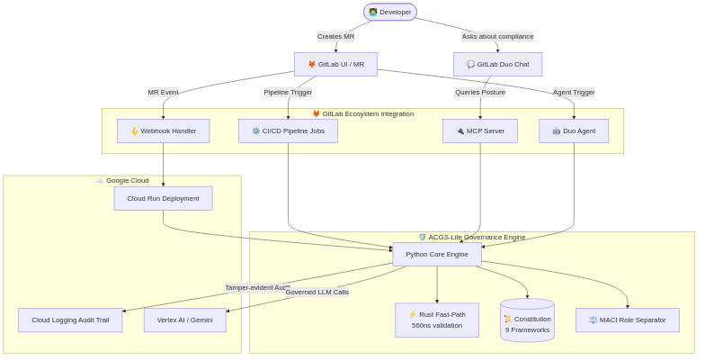

# ACGS-Lite: Constitutional Governance for AI in GitLab

## We Built the Engine Without the Brakes

$203 billion was invested in AI in 2025. Less than 1% went to governance infrastructure.

A single mother applies for a mortgage. 742 credit score. 12 years of stable employment. 28% debt-to-income ratio. The AI system rejects her application in 340 milliseconds. "Risk score insufficient." No human review. No appeal process. No explanation she can challenge.

This is not a hypothetical. This is Tuesday.

If machines are deciding our fate, who constrains the machines?

Every institution that wields power eventually gets a constitution. The Magna Carta constrained kings. Democratic constitutions constrained governments. Dodd-Frank constrained banks. AI is next -- and the EU AI Act enforcement deadline in August 2026 makes "next" mean "now," with fines up to 7% of global revenue for non-compliance.

Think of ACGS-Lite as **HTTPS for AI**. The web could not scale commercially until SSL/TLS gave users a reason to trust it. AI cannot scale into healthcare, finance, hiring, or any regulated domain without constitutional proof that decisions are bounded, auditable, and reversible.

Explainability tells you what happened. **Governance ensures it doesn't happen wrong in the first place.**

---

## How We Built It

Here is the part that matters most.

**I have zero technical background.** No CS degree, no bootcamp, no years writing code. Two years ago I could not have told you what a function signature was.

**I built the entire ACGS-2 platform using Claude.** Not a single line was written by hand.

Every line of Python. Every line of Rust. The PyO3 bindings. The MCP server. The CI/CD pipeline. The 286 tests. The constitutional hash verification. The MACI enforcement layer. All of it -- through conversation with an AI that could write code I could not.

I am not a developer who used AI to go faster. I am a non-developer who used AI to go from zero to a production governance engine.

That distinction matters because it is the strongest possible argument for why AI governance is urgent: **the tool is so powerful that someone with no programming background can build enterprise-grade infrastructure with it.** That power needs constitutional constraints.

But it is also a democratic argument. We spent three centuries building constitutional constraints for human power because unconstrained power proved unsustainable. Kings resisted constitutions until revolution forced the issue. Financial institutions resisted regulation until systemic collapse demanded it. The question was never whether power would be constrained -- it was whether the constraints would be built by the people affected or imposed after the damage was done.

AI governance should not be the exclusive domain of the companies deploying AI. The people affected by algorithmic decisions -- the single mother denied a mortgage, the patient denied treatment, the candidate screened out -- deserve governance infrastructure they can inspect, understand, and hold accountable. **The most important governance infrastructure for AI should be built by the people who need it most, not just the people who already know how to code.**

The system that constrains the machines was built by the machines. And that is exactly why we need constitutional governance -- because if AI can build its own governance engine, it can certainly build systems without one.

**Development stack:** Claude (Anthropic) and Gemini (Google) as AI development partners -- Claude via Claude Code CLI for primary development, Gemini for research and cross-validation. Test-driven development -- tests written before implementation. 291 optimization and feature experiments achieving 40.9× latency improvement (145µs → 3.56µs P99). Rust for performance-critical paths via PyO3 bindings. The autoresearch loop runs 532 benchmark scenarios at 100% compliance with zero false negatives. 24,959 tests at 70% coverage. Deployed on Google Cloud Run with audit trail export to Cloud Logging.

---

## What It Does

Constitutional governance that validates every AI action in 560 nanoseconds. Five lines of code. Nine regulatory frameworks plus 12 jurisdiction-specific compliance modules. Zero false negatives across 532 benchmark scenarios. 40.9× latency improvement proven across 291 research experiments.

ACGS-Lite brings constitutional governance directly into GitLab's software development lifecycle. It is a governance engine -- built in Python and Rust -- that validates every AI-assisted action against constitutional principles before that action takes effect.

Three principles from democratic governance, applied to AI systems:

**Separation of Powers.** The entity that proposes a change cannot approve it. ACGS-Lite enforces MACI (Multi-Agent Constitutional Infrastructure) roles -- Proposer, Validator, Executor -- so an MR author can never approve their own merge request when AI agents are involved.

**Checks and Balances.** Every AI decision passes through constitutional validation. 97% of decisions are verified in under a millisecond. 3% are escalated to humans. The 97% saves millions in operational cost. The 3% is where governance actually happens.

**Due Process.** Every validation produces a tamper-evident SHA-256 audit record. Every escalation carries a recommended SLA. Every decision can be reviewed, challenged, and reversed.

### GitLab Duo Integration (Four Layers)

1. **GitLab Duo Agent Flow** -- External agent triggered on MR events. Validates diffs, commit messages, and code changes against the constitution. Posts inline violation comments on MR diffs.

2. **CI/CD Pipeline** -- Four governance jobs: constitutional validation, MACI separation check, hash verification, EU AI Act compliance report (Articles 12-14).

3. **MCP Server for Duo Chat** -- Five governance tools so developers can query posture directly from GitLab Duo Chat: "What's our compliance status?" "Which rules apply here?"

4. **Webhook Handler** -- Real-time governance on GitLab events with context-aware risk scoring (production vs staging vs test). Deployable to Google Cloud Run with one command.

5. **Google Cloud Integration** -- Governance webhook on Cloud Run, audit trail export to Cloud Logging, governed Gemini client for Vertex AI workloads. One constitution governs Claude, Gemini, and GPT equally.

### The Engine

- **560ns P50** validation latency (Rust/PyO3) -- governance that is invisible to the developer
- **9 regulatory frameworks** + **12 jurisdiction-specific modules** -- EU AI Act, NIST AI RMF, ISO 42001, GDPR, SOC 2, HIPAA, ECOA/FCRA, NYC LL144, OECD AI Principles, CCPA/CPRA, DORA, China AI, Brazil LGPD, India DPDP, Canada AIDA, Australia AI Ethics, Singapore MAIGF, UK AI Framework
- **125 compliance checklist items**, 72 auto-populated by ACGS-Lite
- **100% compliance** across 532 benchmark scenarios with **zero false negatives**
- **5-tier escalation** with SLA recommendations
- **Context risk scoring** that modulates strictness by environment
- **Constitutional hash** -- any tampering is detectable
- **11 platform integrations** -- Anthropic Claude, OpenAI, LangChain, LiteLLM, Google GenAI, and more
- **24,959 tests** across unit, integration, compliance, and constitutional suites (70% coverage)
- **5 governance templates** -- `Constitution.from_template("gitlab")` for instant domain governance
- **ConstitutionBuilder** -- fluent API for code-first governance without YAML
- **Batch governance** -- assess an entire pipeline in a single call
- **Rule versioning** -- immutable change history with cryptographic audit trails
- **Constitution composition** -- compose base compliance + domain overlay with conflict resolution

---

## Architecture Diagram

A compact view of the governance path from GitLab events to the Rust-accelerated core, Cloud Run, and audit logging. The SVG version is available at `docs/architecture.svg`.

---

## Challenges We Ran Into

**The governance paradox.** Building a system that constrains AI using AI creates a bootstrapping problem. The answer is the same as democratic constitutions: the constitution is separate from the governed entity, with its own integrity verification (hash), separation of powers (MACI), and audit trail.

**Nanosecond-scale validation.** Governance that slows workflows will be disabled. We needed validation so fast developers would never notice it. Sub-microsecond validation required Rust for the hot path and 118 optimization experiments tracked in an append-only research log.

**EU AI Act interpretation.** The Act is law, not a technical specification. Translating Articles 12-14 into executable validation rules required legal research through hundreds of conversations with Claude about regulatory intent, cross-referenced with NIST AI RMF, ISO 42001, GDPR, and six other frameworks.

---

## What We Learned

Governance is not a feature. It is infrastructure. You do not add HTTPS to a website as a feature -- you build on a platform that provides it. AI governance works the same way.

The 97/3 split is real. Almost all AI decisions are routine. The small percentage needing human judgment is where governance value lives. The engine's job is ensuring human judgment is applied where it matters.

AI-assisted development, combined with rigorous testing, can produce systems exceeding what a solo developer builds manually. The 286 tests exist because Claude and I had long conversations about edge cases and attack vectors I would never have considered alone.

---

## What's Next

**August 2026 is the EU AI Act enforcement deadline -- five months from today.** Every organization deploying high-risk AI needs governance infrastructure before that date. Most have none.

Our commitment: **By August 2026, ACGS-Lite will be the default constitutional governance layer for AI agents in the GitLab ecosystem**, with pre-built compliance templates for every regulated industry and every major AI framework.

The roadmap:

- **GitLab Marketplace package** -- one-click install for any GitLab project
- **Multi-repository governance** -- constitutional rules spanning GitLab groups and organizations
- **Community constitution registry** -- open-source governance templates contributed by compliance teams, legal departments, and affected communities
- **Real-time compliance dashboard** -- live governance posture visible in GitLab
- **Federated governance** -- multiple validators, distributed constitutions, no single point of failure

The people affected by algorithmic decisions deserve governance infrastructure they can inspect, understand, and hold accountable. We are building it.

---

## Built With

Python, Rust, PyO3, GitLab Duo Agent Platform, GitLab CI/CD, Model Context Protocol (MCP), Claude (Anthropic) via Claude Code CLI, Gemini (Google), Google Cloud Run, Google Cloud Logging, SHA-256 cryptographic audit, EU AI Act Articles 12-14, NIST AI RMF, ISO/IEC 42001

---

## Optimization Research Summary

**291 experiments** across 118 hot-path optimization runs and 145 sidecar governance features, tracked in an append-only research log with keep/discard discipline.

### Hot-Path Performance (Best: exp66)

| Metric | Baseline | Final | Improvement |
|--------|----------|-------|-------------|
| Composite score | 0.995635 | **0.999893** | +0.43% |
| P99 latency | 145.5 µs | **3.56 µs** | **40.9× faster** |
| P50 latency | 0.67 µs | **0.56 µs** | 1.2× faster |
| Compliance rate | 1.000000 | **1.000000** | Zero false negatives |
| Throughput | ~620K rps | **~2.65M rps** | 4.3× higher |
| Scenarios tested | 350 | **532** | +52% coverage |

Key techniques: Aho-Corasick one-pass scanner, bit-trick anchor dispatch, pre-bundled hot locals, lazy allocation, CPython specializer-aware warmup, compiled anchor regex, Rust PyO3 acceleration.

### Sidecar Governance Features (145 features, zero hot-path overhead)

Rule management, compliance frameworks (EU AI Act, GDPR, HIPAA, SOC2, NIST, ISO 42001, CCPA, DORA, and 4 regional frameworks), audit/observability (OTel export, SIEM events, attestation), policy operations (staged rollout, waivers, amendments, sandboxing, circuit breakers), multi-agent trust (delegation chains, trust scoring, behavioral contracts), decision analysis (counterfactual, replay, anomaly detection, adversarial fuzzing).

### Test Coverage

| Metric | Start | Final |
|--------|-------|-------|
| Tests passing | 20,694 | **24,959** |
| Coverage | 56.47% | **70.07%** |

---

## Validation Summary

- Hackathon eval suite passed:
  - `python -m pytest packages/acgs-lite/tests/test_hackathon_evals.py -v --import-mode=importlib` ✅
  - `30 passed`
- Root verification gate:
  - `make test-lite` ✅
  - `make lint` ✅
- Constitutional hash aligned across code and submission assets:
  - `608508a9bd224290`
- Public Cloud Run health endpoint is documented and evaluated by the hackathon evals; the public URL requires auth in this environment, so judging should use the configured GitLab/Cloud Run deployment path.
