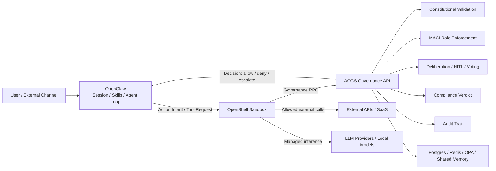
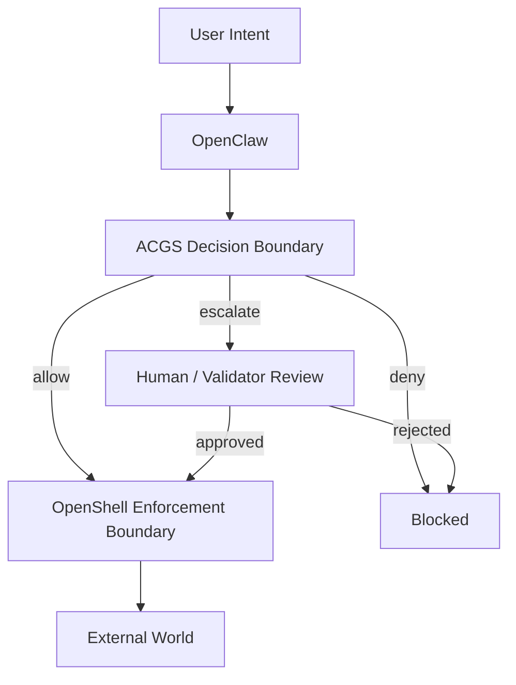
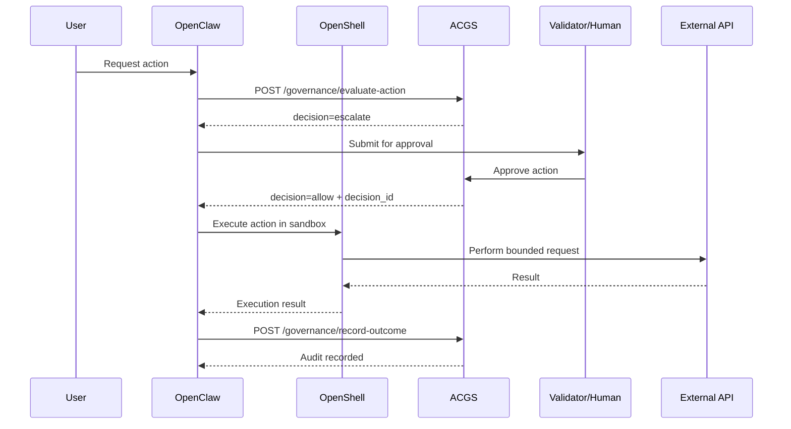

# ACGS + OpenShell + OpenClaw Integration

## Purpose

This document defines a practical integration pattern for running OpenClaw inside OpenShell while
delegating governance decisions, MACI separation-of-powers, compliance verdicts, and durable audit
logging to ACGS.

The target deployment model is:

- OpenClaw handles channels, sessions, and agent loops.
- OpenShell enforces sandbox, egress, filesystem, process, and inference boundaries.
- ACGS acts as the governance control plane and audit spine.

## Architecture

### Logical Overview



### Boundary Model



### High-Risk Action Flow



## Design Principles

- OpenClaw proposes actions but does not self-authorize high-risk execution.
- OpenShell enforces hard runtime boundaries but does not interpret business governance semantics.
- ACGS makes governance decisions but does not directly own external side effects.
- High-risk actions require both a governance decision and an execution boundary.
- Proposer, validator, and executor identities must remain distinct for governed actions.

## Role Mapping

| Role | Runtime Mapping | Responsibility |
| ---- | --------------- | -------------- |
| Proposer | OpenClaw primary agent | Draft action intent |
| Validator | Human reviewer or validator agent | Approve or reject |
| Executor | OpenShell sandbox worker | Execute approved action |

### MACI Rules

- The proposer must not approve its own high-risk action.
- The validator should not execute the same high-risk action.
- The executor should consume a bounded approval artifact rather than broad governance authority.

## Integration Contract

### Action Envelope

All governed actions should be normalized into a stable envelope before they reach ACGS.

Required fields:

- `request_id`
- `session_id`
- `actor`
- `resource`
- `action_type`
- `operation`
- `risk_level`
- `payload_hash`
- `requires_network`
- `requires_secret`

This avoids coupling governance rules to individual OpenClaw skills.

### Governance Decision Outcomes

ACGS returns one of:

- `allow`
- `deny`
- `escalate`
- `require_separate_executor`

### OpenShell Policy Intent

OpenShell should apply deny-by-default outbound controls and explicitly allow:

- the ACGS governance endpoint
- approved model providers
- approved SaaS targets required by the action

Example intent:

```yaml
network:
  default: deny
  allow:
    - host: acgs.internal.example.com
      methods: [GET, POST]
    - host: api.github.com
      methods: [GET, POST]
filesystem:
  deny_write:
    - /host
    - /secrets
process:
  deny_privilege_escalation: true
inference:
  route_managed: true
```

## Minimal API Surface

Recommended first-pass endpoints:

- `POST /governance/evaluate-action`
- `POST /governance/submit-for-approval`
- `POST /governance/review-approval`
- `POST /governance/record-outcome`

These cover:

- decisioning
- approval handoff
- validator review
- outcome recording

## Audit Requirements

Every governed action should leave an audit trail with:

- request ID
- decision ID
- session ID
- sandbox ID
- proposer / validator / executor IDs
- action type
- resource URI
- payload hash
- compliance verdict
- decision reason codes
- execution outcome
- external references

## Rollout Plan

### Phase 0: Observe Only

- OpenClaw calls ACGS for high-risk actions.
- ACGS responds, but execution is not yet blocked.
- Collect false positives, latency, and decision coverage.

### Phase 1: Soft Gate

- Human approval becomes required for a small set of write actions.
- OpenShell still allows only the minimal approved egress set.

### Phase 2: Hard Gate

- No high-risk action runs without an ACGS decision.
- Denials are enforced by both the governance layer and runtime boundary.

### Phase 3: Full MACI

- Proposer / validator / executor are fully separated.
- Shared memory writes and external mutations all require governed flow.

## MVP Scope

Recommended first governed action classes:

- `http.write`
- `filesystem.write`
- `github.write`
- `memory.shared_write`

This is enough to validate:

- action normalization
- governance RPC
- approval flow
- runtime enforcement
- durable audit closure

## Code Skeleton

The initial Python skeleton for this integration lives in:

- `src/acgs_lite/integrations/openshell_governance.py`

It provides:

- Pydantic request/response models
- a FastAPI router factory
- a lightweight app factory
- placeholder decision logic suitable for a PoC

