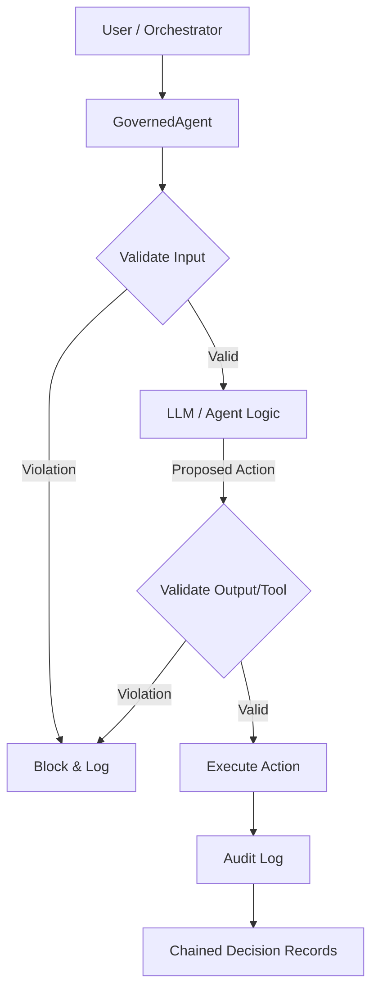

# Architecture: The Agentic Firewall Lifecycle

**Meta Description**: Deep dive into the ACGS-Lite architecture. Learn about the Governance Engine, the validation lifecycle, and how MACI roles enforce separation of powers.

---

ACGS-Lite is built on the principle of **Deterministic Runtime Governance**. Unlike "safety tuning" or "system prompts" which are probabilistic and can be bypassed, ACGS-Lite interposes a hard, code-level boundary between an agent and its environment.

## 🏛️ System Overview

The core of ACGS-Lite is the **Verification Kernel**, which manages the interaction between the cognitive layer (the LLM) and the execution layer (tools/APIs).

---

## 🛡️ Core Components

### 1. The Constitution
The **Constitution** is an immutable set of `Rule` objects. Every rule has an `id`, a `pattern` (Regex), a `severity`, and an optional `condition` (Python expression).
*   **Constitutional Hash**: A SHA-256 hash of the entire rule set. This ensures that the governance logic hasn't been tampered with during deployment.

### 2. The Governance Engine
The `GovernanceEngine` is the deterministic "Judge." It evaluates text (input or output) against the Constitution and returns a `ValidationResult`.
*   **Fail-Closed Design**: If the engine encounters an internal error (e.g., a malformed regex or memory issue), it defaults to `valid=False`. Safety is never sacrificed for availability.

### 3. Governed Wrappers
The library provides `GovernedAgent`, `GovernedCallable`, and framework-specific adapters (OpenAI, Anthropic, etc.). These wrappers intercept calls and manage the validation lifecycle automatically.

---

## 🚦 The Validation Lifecycle

Every action in ACGS-Lite follows a 4-step lifecycle:

1.  **Intercept**: The call is paused before execution.
2.  **Verify**: The engine checks the action against the active Constitution.
3.  **Audit**: The result (Pass/Fail) is recorded in the `AuditLog` with a cryptographic signature.
4.  **Act**: If passed, the action executes. If failed, a `ConstitutionalViolationError` is raised.

---

## ⚖️ MACI: Separation of Powers

In mission-critical systems, a single agent should not have the power to both propose and approve an action. ACGS-Lite enforces **MACI (Monitor-Approve-Control-Inspect)** roles:

| Role | Responsibility | Implementation |
| :--- | :--- | :--- |
| **Proposer** | Generates the action | The LLM/Agent |
| **Validator** | Checks against the rules | The ACGS `GovernanceEngine` |
| **Executor** | Performs the approved task | The `GovernedAgent` wrapper |
| **Observer** | Records the history | The `AuditLog` backend |

By strictly separating these roles, ACGS-Lite ensures that even if a Proposer (the agent) is compromised via prompt injection, it physically cannot bypass the Validator (the engine).

---

## 📈 Advanced Features

### Governance Circuit Breaker
To prevent "recursive failure loops" where an agent repeatedly tries to violate a policy, ACGS-Lite includes a **Circuit Breaker**. If an agent hits X violations within Y minutes, the circuit breaker trips and blocks all further actions from that `agent_id` until a human reset.

### Formal Verification (Z3)
For financial or safety-critical logic, ACGS-Lite supports the **Z3 SMT Solver**. This allows you to define mathematical constraints (e.g., `balance >= withdrawal_amount`) that are proven safe before execution.

### Leanstral Proof Certificates
For high-assurance environments, the `LeanstralVerifier` can generate Lean 4 proof certificates using Mistral models, providing a machine-verifiable proof of safety for every governance decision.

---

## Next Steps
- Learn how to [Configure Your First Rules](quickstart.md).
- See [2026 Regulatory Compliance](compliance-2026.md) mappings.
- Explore the [Industry Use Cases](use-cases.md).
