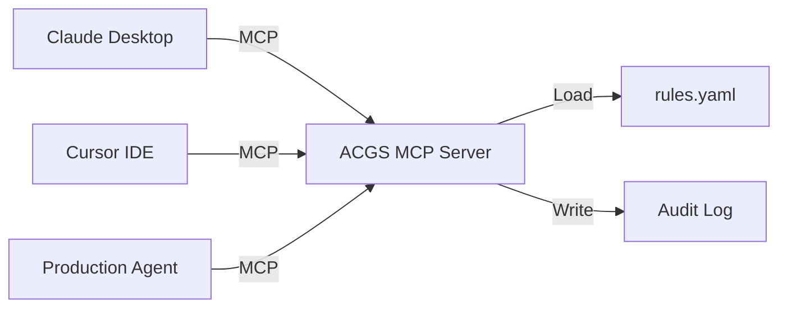

# MCP Governance Guide: Centralizing Agent Safety

**Meta Description**: A comprehensive guide to using ACGS-Lite as a Model Context Protocol (MCP) server. Centralize your safety rules across Claude Desktop, Cursor, and your custom agent mesh.

---

The **Model Context Protocol (MCP)** is the 2026 standard for agentic interoperability. By running ACGS-Lite as an MCP server, you turn your governance rules into a **Centralized Safety Service** that any MCP-compliant client can use.

## 🏗️ Architecture

Instead of each agent having its own copy of the safety rules, they all call the **MCP Governance Server**. This ensures that a policy change in your `rules.yaml` is instantly applied to every agent in your organization.



---

## 🚀 Quick Start

### 1. Configure the Server
You can run the server via stdio (standard for desktop apps) or SSE (standard for web/remote apps).

```bash
# Start the server with a specific constitution
python -m acgs_lite.integrations.mcp_server --constitution rules.yaml
```

### 2. Connect Your IDE (Claude Desktop)
Add the following to your `claude_desktop_config.json`:

```json
{
  "mcpServers": {
    "acgs-governance": {
      "command": "python",
      "args": ["-m", "acgs_lite.integrations.mcp_server", "--constitution", "/path/to/rules.yaml"]
    }
  }
}
```

---

## 🧰 The Governance Toolset

Once connected, your agent (e.g., Claude 3.5 Sonnet) will "see" these tools and can use them to ensure its own compliance.

### `validate_action`
The core tool. It checks a proposed action against the Constitution.
*   **Input**: `action` (string), `agent_id` (string).
*   **Usage**: The agent should call this *before* it performs any high-risk task like writing to a file or executing code.

### `check_compliance`
A lightweight, non-logging version of `validate_action`. Useful for real-time checks during brainstorming.

### `get_constitution`
Allows the agent to read its own safety rules. This helps the model "understand" the boundaries of its safe zone.

---

## 🛡️ Enforcement Strategies

### Strategy A: Self-Governance (Soft)
The agent is instructed to check its own actions.
*   **Pros**: Low latency, easy to implement.
*   **Cons**: Relies on the agent's "honesty" and ability to follow instructions under pressure.

### Strategy B: Orchestrator-Enforced (Hard)
A "Manager Agent" or a middleware layer intercepts every tool call and sends it to the MCP Governance Server for validation.
*   **Pros**: Deterministic, bypass-resistant.
*   **Cons**: Slightly higher latency (though typically <20ms).

---

## 📊 Monitoring & Auditing

The MCP Server automatically records every tool call to your configured `AuditBackend`. In 2026, it is standard practice to point all MCP servers to a centralized **JSONL Audit Stream** for real-time compliance monitoring.

```bash
# Check the status of your MCP governance mesh
acgs status --mcp
```

## Next Steps
- Learn how to [Deploy to Cloud Run](architecture.md#cloud-run) as a remote MCP server.
- Review the [2026 Regulatory Compliance](compliance-2026.md) requirements.
- See [Advanced Safety Patterns](supervisor-models.md).
