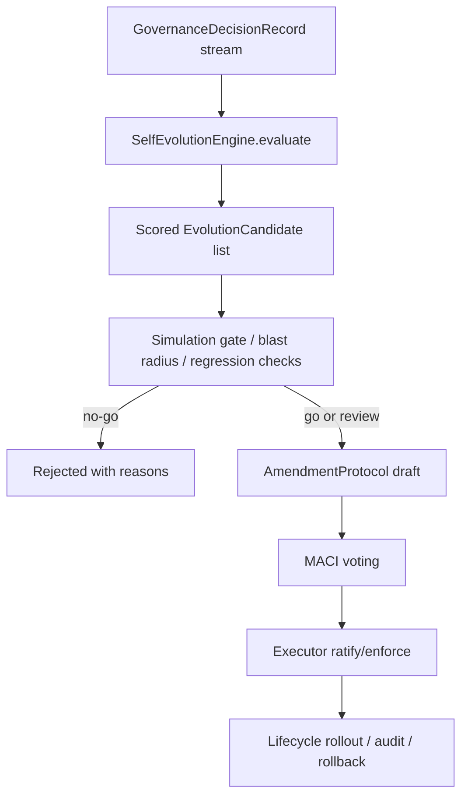

# Governed Self-Evolution

ACGS-Lite self-evolution is a closed-loop policy improvement workflow. It analyzes runtime decision feedback, proposes constitutional changes, simulates their blast radius, and submits approved candidates into the existing amendment protocol. It does **not** let an agent rewrite or enforce its own validation logic.

## Why this exists

Production governance systems drift: new risk patterns appear, rules fire too often or too late, and low-confidence allow decisions accumulate. Self-evolution converts those signals into auditable improvement proposals while preserving deterministic enforcement and MACI separation of powers.

## Safety model

The self-evolution loop follows five gates:

1. **Observe** decision records, violations, confidence, triggered rules, and audit IDs.
2. **Propose** scored `EvolutionCandidate` objects. Candidates are plain data, not mutations.
3. **Simulate** candidates against an action corpus with `SelfEvolutionEngine.gate_candidates()`.
4. **Amend** only passing candidates through `AmendmentProtocol` voting and ratification.
5. **Roll out** through the normal lifecycle/bundle controls, where operators can stage, monitor, and roll back.



## Current candidate types

`SelfEvolutionEngine` currently detects:

- **Uncovered denials**: denied decisions with violation evidence but no active rule hit. Output: `add_rule` candidate.
- **Hot rules**: frequently triggered deny rules. Output: `modify_rule` candidate that increases priority and may escalate non-blocking severity to `high`.
- **Low-confidence allows**: repeated allowed decisions below the configured confidence threshold. Output: `add_rule` candidate requiring human review.

## Pre-amendment simulation gate

`gate_candidates(report, constitution, action_corpus)` rejects candidates before the amendment workflow if:

- the action corpus is empty,
- deny-to-allow regressions are introduced and `allow_regressions=False`,
- blast radius exceeds `SelfEvolutionConfig.max_blast_radius`, or
- weighted transition risk exceeds `SelfEvolutionConfig.max_weighted_risk`.

This aligns with AI governance/MLOps release discipline: observe continuously, evaluate offline, gate risky changes, preserve approval trails, and roll out with rollback support.

## Reproducible corpus artifact

For command-line experiments, build a provenance-preserving JSONL corpus from decision logs:

```bash
python scripts/build_evolution_corpus.py decisions.jsonl --output corpus.jsonl --validate-schema
```

Each row includes a stable ID, normalized text, source field, source audit IDs, observed decisions, labels, and a coverage category. This makes gate results reproducible and independently auditable.

## Minimal usage

```python
from acgs_lite.constitution import Constitution, SelfEvolutionConfig, SelfEvolutionEngine
from acgs_lite.constitution.amendments import AmendmentProtocol

constitution = Constitution.default()
engine = SelfEvolutionEngine(SelfEvolutionConfig(min_support=3))

report = engine.evaluate(decision_records, constitution)
action_corpus = engine.action_corpus_from_records(decision_records)
gate_report = engine.gate_candidates(
    report,
    constitution,
    action_corpus=action_corpus,
)

approved_report = gate_report.to_evolution_report(
    input_records=report.input_records,
    skipped=report.skipped,
)

protocol = AmendmentProtocol(quorum=2, approval_threshold=0.66)
amendments = engine.draft_amendments(
    approved_report,
    protocol,
    proposer_id="policy-proposer",
    open_voting=True,
    gate_report=gate_report,
)
```

When `gate_report` is supplied, drafted amendments include the candidate evidence, the per-candidate gate result, and a canonical `gate_report_hash` in amendment metadata.

## Recommended operating controls

- Keep `min_support` above 1 in production to avoid one-off noise.
- Use a representative regression corpus: recent allowed actions, denied actions, canary incidents, and known compliance fixtures.
- Use `action_corpus_from_records()` as a baseline corpus builder, then add curated regression/canary fixtures for stronger coverage.
- Treat `review` recommendations as human-review-required, not auto-merge.
- Keep `allow_regressions=False` for safety-critical deployments.
- Treat gate failures as fail-closed: invalid generated candidates and simulation errors should be fixed upstream, not drafted as amendments.
- Store `EvolutionGateReport.to_dict()` alongside amendment metadata for auditability.
- Pair accepted amendments with lifecycle rollout stages and rollback plans.
