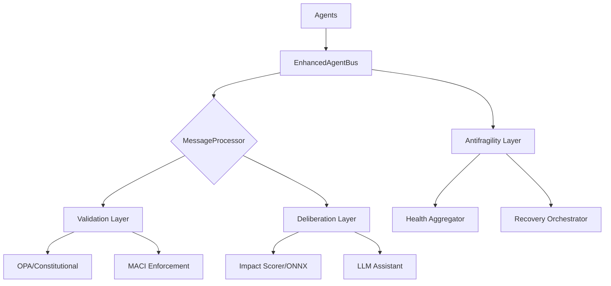

# Enhanced Agent Bus

<!-- Constitutional Hash: 608508a9bd224290 -->

[](./tests/)
[](./coverage.json)
[](https://python.org)
[](../../LICENSE)

> **Version:** 2.5.0
> **Status:** Active repository package
> **Tests:** Run `python -m pytest packages/enhanced_agent_bus/tests/ --import-mode=importlib`
> **Performance:** Benchmark from the current checkout before quoting latency or throughput
> **Dependencies:** Redis/OPA optional for some features, required for full local stack

### Quality status

- **Test pass rate:** latest observed full run passed 23,792 tests (99.98%)
- **Coverage gate:** CI enforces 80% minimum for this package
- These are different signals: pass rate reflects the latest observed run; coverage gate reflects the CI threshold
- 4 residual failures are test-isolation-order-dependent (env-var pollution, optional dep mocks); they pass in isolation

## Overview

The Enhanced Agent Bus is the platform runtime layer for ACGS, historically referenced internally as ACGS-2. It provides high-performance, constitutionally compliant message routing between AI agents with built-in policy validation, MACI role enforcement, and comprehensive antifragility features.

### Key Capabilities

| Capability | Description | Status |
| ----------------------------- | ------------------------------------------------------------ | ------------- |
| **Constitutional Compliance** | Messages and workflows can be validated against constitutional rules and hash-bound governance paths | Implemented |
| **High Performance** | Designed for low-latency routing; measure current performance from this checkout before quoting numbers | Implemented |
| **MACI Role Separation** | Trias Politica enforcement (Executive/Legislative/Judicial) | Implemented |
| **Antifragility** | Health aggregation, recovery orchestration, chaos testing | Implemented |
| **Multi-Backend** | Pure Python with optional Rust acceleration in selected paths | Available |

## Quick Start

### Installation

```bash
# Core dependencies
pip install redis httpx pydantic

# Development dependencies
pip install pytest pytest-asyncio pytest-cov fakeredis

# Optional: Rust backend for maximum performance
cd enhanced_agent_bus/rust && cargo build --release
```

### Basic Usage

```python
from enhanced_agent_bus import EnhancedAgentBus, AgentMessage, MessageType, Priority

async def main():
    # Initialize and start the bus
    bus = EnhancedAgentBus()
    await bus.start()

    # Register agents
    await bus.register_agent(
        agent_id="governance-agent",
        agent_type="governance",
        capabilities=["policy_validation", "compliance_check"]
    )

    # Send a message
    message = AgentMessage(
        message_type=MessageType.COMMAND,
        content={"action": "validate", "policy_id": "P001"},
        from_agent="governance-agent",
        to_agent="audit-agent",
        priority=Priority.HIGH
    )
    result = await bus.send_message(message)

    await bus.stop()

asyncio.run(main())
```

### With MACI Role Enforcement

```python
from enhanced_agent_bus import EnhancedAgentBus
from enhanced_agent_bus.maci_enforcement import MACIRole

# Enable MACI for constitutional role separation
bus = EnhancedAgentBus(enable_maci=True, maci_strict_mode=True)
await bus.start()

# Register agents with specific roles
await bus.register_agent(
    agent_id="policy-proposer",
    agent_type="executive",
    maci_role=MACIRole.EXECUTIVE,  # Can PROPOSE, SYNTHESIZE, QUERY
)
await bus.register_agent(
    agent_id="validator",
    agent_type="judicial",
    maci_role=MACIRole.JUDICIAL,   # Can VALIDATE, AUDIT, QUERY
)
```

## Architecture



For a focused breakdown of the refactored message-processing pipeline, see
[`docs/MESSAGE_PROCESSOR_ARCHITECTURE.md`](./docs/MESSAGE_PROCESSOR_ARCHITECTURE.md).
For the final wrapper inventory and residual-risk audit, see
[`docs/MESSAGE_PROCESSOR_FINAL_ARCHITECTURE_AUDIT.md`](./docs/MESSAGE_PROCESSOR_FINAL_ARCHITECTURE_AUDIT.md).
For the post-refactor wrapper retirement sequence and coverage-shard blocker map, see
[`docs/MESSAGE_PROCESSOR_COVERAGE_REGEN_CLEANUP_PLAN.md`](./docs/MESSAGE_PROCESSOR_COVERAGE_REGEN_CLEANUP_PLAN.md).

## Core Components

### Message Types

| Type                 | Description          | Use Case                    |
| -------------------- | -------------------- | --------------------------- |
| `COMMAND`            | Direct agent command | Initiate governance actions |
| `QUERY`              | Information request  | Read-only data retrieval    |
| `EVENT`              | Event notification   | Status updates, alerts      |
| `GOVERNANCE_REQUEST` | Governance action    | Policy changes, votes       |
| `BROADCAST`          | Multi-agent message  | System-wide notifications   |

### Priority Levels

| Priority   | Value | Processing                 |
| ---------- | ----- | -------------------------- |
| `CRITICAL` | 4     | Immediate, bypasses queues |
| `HIGH`     | 3     | Priority queue             |
| `NORMAL`   | 2     | Standard queue             |
| `LOW`      | 1     | Background processing      |

### MACI Role Permissions

| Role            | Allowed Actions                  | Prohibited Actions                 |
| --------------- | -------------------------------- | ---------------------------------- |
| **EXECUTIVE**   | PROPOSE, SYNTHESIZE, QUERY       | VALIDATE, AUDIT, EXTRACT_RULES     |
| **LEGISLATIVE** | EXTRACT_RULES, SYNTHESIZE, QUERY | PROPOSE, VALIDATE, AUDIT           |
| **JUDICIAL**    | VALIDATE, AUDIT, QUERY           | PROPOSE, EXTRACT_RULES, SYNTHESIZE |

## Antifragility Features

### Health Aggregation

Real-time system health scoring (0.0-1.0) with fire-and-forget callbacks:

```python
from enhanced_agent_bus.health_aggregator import HealthAggregator, SystemHealthStatus

aggregator = HealthAggregator()
snapshot = await aggregator.get_health_snapshot()

if snapshot.status == SystemHealthStatus.CRITICAL:
    await trigger_recovery()
```

### Recovery Orchestration

Priority-based recovery with 4 strategies:

```python
from enhanced_agent_bus.recovery_orchestrator import RecoveryOrchestrator, RecoveryStrategy

orchestrator = RecoveryOrchestrator()
await orchestrator.submit_recovery(
    task_id="redis-recovery",
    strategy=RecoveryStrategy.EXPONENTIAL_BACKOFF,
    max_retries=5
)
```

### Chaos Testing

Controlled failure injection for resilience testing:

```python
from enhanced_agent_bus.chaos_testing import ChaosEngine, ChaosScenario

engine = ChaosEngine(emergency_stop_enabled=True)
scenario = ChaosScenario(
    name="latency-test",
    chaos_type=ChaosType.LATENCY,
    intensity=0.3,
    blast_radius=0.1  # Max 10% of requests affected
)

async with engine.run_scenario(scenario):
    # Run tests under chaos conditions
    result = await bus.send_message(test_message)
```

## Swarm Intelligence

Multi-agent coordination with dynamic spawning and Byzantine fault-tolerant consensus:

```python
from enhanced_agent_bus.swarm_intelligence import (
    SwarmCoordinator,
    AgentCapability,
    TaskPriority,
    create_swarm_coordinator,
)

# Create coordinator
coordinator = create_swarm_coordinator(max_agents=8)

# Spawn agents with capabilities
agent = await coordinator.spawn_agent(
    name="validator-1",
    capabilities=[AgentCapability(name="policy_validation", level=0.9)]
)

# Submit tasks with automatic decomposition
task_id = await coordinator.submit_task(
    description="Validate governance proposal",
    required_capabilities=["policy_validation"],
    priority=TaskPriority.HIGH,
    decompose=True,
)
```

## Saga Persistence

Distributed saga state management with PostgreSQL and Redis backends:

```python
from enhanced_agent_bus.saga_persistence import (
    create_saga_repository,
    SagaBackend,
    PersistedSagaState,
)

# Create repository (auto-detects backend from SAGA_BACKEND env var)
repo = await create_saga_repository(SagaBackend.REDIS, redis_url="redis://localhost")

# Create and persist saga state
saga = PersistedSagaState(
    saga_name="governance_decision",
    tenant_id="tenant-123",
)
await repo.save(saga)

# Retrieve with distributed locking
async with repo.lock(saga.saga_id):
    saga = await repo.get(saga.saga_id)
```

## Performance

Performance characteristics depend on the enabled subsystems, optional dependencies, and whether
Redis/OPA and other backends are available. Use the repository benchmark and test commands to
measure the current checkout instead of relying on hard-coded numbers in this README.

### Optimization Tips

1. **Enable Rust Backend**: Set `USE_RUST_BACKEND=true` for measurable speedup on benchmark paths; measure from the current checkout before quoting numbers
2. **Use Redis Registry**: Distributed agent registry for multi-node deployments
3. **Enable Metering**: Fire-and-forget billing with <5μs latency impact
4. **Circuit Breakers**: Prevent cascade failures under load

## Testing

```bash
# Run all package tests
python3 -m pytest packages/enhanced_agent_bus/tests/ -v --import-mode=importlib

# Run with coverage
python3 -m pytest packages/enhanced_agent_bus/tests/ --cov=packages/enhanced_agent_bus --cov-report=html --import-mode=importlib

# Constitutional tests only
python3 -m pytest packages/enhanced_agent_bus/tests/ -m constitutional --import-mode=importlib

# MACI role tests
python3 -m pytest packages/enhanced_agent_bus/tests/test_maci*.py -v --import-mode=importlib

# Antifragility tests
python3 -m pytest packages/enhanced_agent_bus/tests/test_health_aggregator.py packages/enhanced_agent_bus/tests/test_chaos_framework.py -v --import-mode=importlib
```

### Test Categories

| Category | Description |
| -------------- | ---------------------------------- |
| Core | Bus operations, message processing |
| Constitutional | Hash validation, compliance |
| MACI | Role separation, permissions |
| Antifragility | Health, recovery, chaos |
| Integration | Cross-module and workflow coverage |

## Configuration

### Environment Variables

| Variable           | Default                  | Description                     |
| ------------------ | ------------------------ | ------------------------------- |
| `REDIS_URL`        | `redis://localhost:6379` | Redis connection URL            |
| `USE_RUST_BACKEND` | `false`                  | Enable Rust acceleration        |
| `METRICS_ENABLED`  | `true`                   | Enable Prometheus metrics       |
| `MACI_STRICT_MODE` | `false`                  | Strict MACI enforcement         |
| `METERING_ENABLED` | `true`                   | Enable usage metering           |
| `SAGA_BACKEND`     | `redis`                  | Saga persistence backend        |
| `DATABASE_URL`     | -                        | PostgreSQL connection for sagas |

### Programmatic Configuration

```python
bus = EnhancedAgentBus(
    redis_url="redis://localhost:6379",
    use_rust=True,
    enable_maci=True,
    maci_strict_mode=True,
    enable_metering=True,
)
```

## Documentation

**Start Here:** [Documentation Portal](./DOCUMENTATION_PORTAL.md) — navigation for package-level docs.

For message-processor internals see the `docs/` subdirectory:
- [`docs/MESSAGE_PROCESSOR_ARCHITECTURE.md`](./docs/MESSAGE_PROCESSOR_ARCHITECTURE.md) — pipeline design and state invariants
- [`docs/MESSAGE_PROCESSOR_FINAL_ARCHITECTURE_AUDIT.md`](./docs/MESSAGE_PROCESSOR_FINAL_ARCHITECTURE_AUDIT.md) — wrapper inventory and residual-risk audit
- [`docs/MESSAGE_PROCESSOR_COVERAGE_REGEN_CLEANUP_PLAN.md`](./docs/MESSAGE_PROCESSOR_COVERAGE_REGEN_CLEANUP_PLAN.md) — post-refactor wrapper retirement and coverage-shard map

## Exception Hierarchy

```
AgentBusError (base)
├── ConstitutionalError
│   ├── ConstitutionalHashMismatchError
│   └── ConstitutionalValidationError
├── MessageError
│   ├── MessageValidationError
│   ├── MessageDeliveryError
│   └── MessageTimeoutError
├── AgentError
│   ├── AgentNotRegisteredError
│   └── AgentCapabilityError
├── PolicyError
│   ├── PolicyEvaluationError
│   └── OPAConnectionError
├── MACIError
│   ├── MACIRoleViolationError
│   └── MACIActionDeniedError
└── BusOperationError
    ├── BusNotStartedError
    └── ConfigurationError
```

## Contributing

1. Ensure all tests pass: `pytest tests/ -v`
2. Maintain 80%+ coverage
3. Include constitutional hash in new files: `608508a9bd224290`
4. Follow MACI role separation for governance code
5. Add tests for new functionality
6. Use proper logging (no `print()` statements)

## License

AGPL-3.0-or-later. See [../../LICENSE](../../LICENSE) for the repository license and
[../../COMMERCIAL_LICENSE.md](../../COMMERCIAL_LICENSE.md) for proprietary/SaaS licensing terms.

---

## Fail-Closed Architecture

The canonical fail-closed implementation lives in `acgs_lite.fail_closed`. This package
imports and extends it — `enhanced_agent_bus.shared.fail_closed` is a superset that adds:

- **callable deny values** (handler receives original `*args, error=exc`)
- **`exceptions` kwarg** (alias for the canonical `reraise` inverse)

Always import `fail_closed` from `enhanced_agent_bus.shared.fail_closed` for bus code; never
create a third version.

## Optional Plugin Registry

`plugin_registry.py` centralizes availability checks for 16 optional modules. Use
`plugin_registry.available("name")` instead of try/except import guards:

```python
from enhanced_agent_bus.plugin_registry import available, require

if available("z3"):
    # Z3 is present — use formal verification path
    ...

# Or raise PluginNotAvailable with install hint:
require("mlflow")  # raises if mlflow not installed
```

Optional plugins include: `z3`, `mlflow`, `numpy`, `pandas`, `sklearn`, `maci_enforcement`,
`maci_strategy`, `ab_testing`, `online_learning`, `opa_guard_mixin`, and others.
Z3 is present but optional and transitional; it is gated through this registry.
Default-state runtime behavior (whether Z3 is invoked in any live path) depends on
deployment config and the verification pipeline feature flags. Do not assume Z3 is
active or inactive without checking the controlling configuration. Cedar is a planned
migration target for the policy evaluation path — it is not yet implemented.

---

_Constitutional Hash: 608508a9bd224290_
_Updated: 2026-04-02_
_Enhanced Agent Bus for ACGS (historically labeled ACGS-2) v2.5.0_
