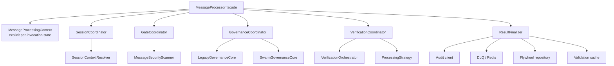
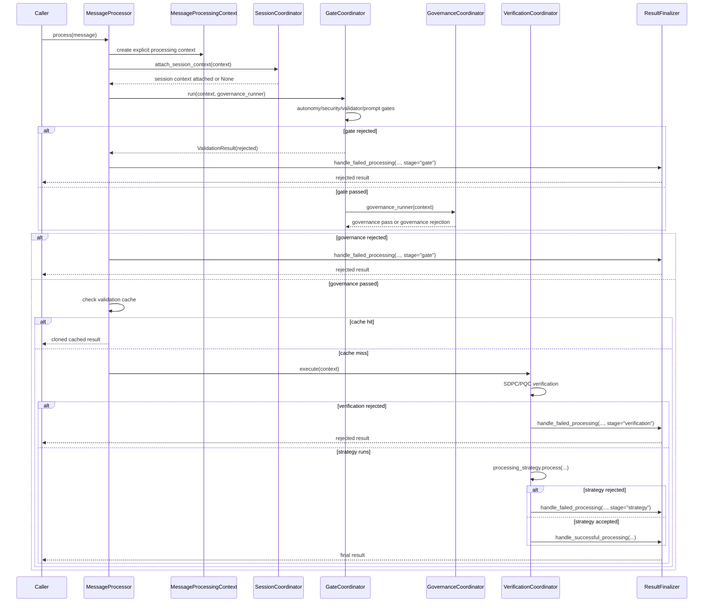

# MessageProcessor Architecture

> Updated: 2026-04-01
> Scope: `packages/enhanced_agent_bus/message_processor.py` and extracted coordinators

## Purpose

`MessageProcessor` is now a thin orchestration facade for the message-validation pipeline.
Mutable per-message runtime state flows through `MessageProcessingContext` instead of being hidden
on `AgentMessage` via dynamic private attributes.

## Design Goals

- Keep `MessageProcessor.process(...)` stable as the public entry point
- Make stage ownership explicit
- Route early failures through the same sink path as strategy failures
- Preserve helper compatibility while moving real logic into dedicated components
- Keep governance/session state fail-closed and observable

## Layered View

## Runtime Call Flow

## Component Responsibilities

### MessageProcessor

Owns:
- public entry point: `process(...)`
- high-level stage ordering
- cache lookup
- construction of `MessageProcessingContext`
- runtime wiring of collaborators
- compatibility wrappers for legacy helper tests / monkeypatching

Does **not** own the detailed logic for gate evaluation, governance execution, verification, or
result sinks.

### MessageProcessingContext

Owns explicit per-invocation state:
- `message`
- `start_time`
- `session_context`
- governance input/decision/receipt/shadow metadata
- `cache_key`
- `cached_result`

This replaces hidden state such as:
- `_governance_decision`
- `_governance_receipt`
- `_governance_shadow_metadata`

### SessionCoordinator

Owns:
- session-governance runtime initialization
- session resolution via `SessionContextResolver`
- attaching resolved session state to `MessageProcessingContext`
- session metrics enrichment
- PACAR/multi-turn session ID extraction helper delegation

### GateCoordinator

Owns:
- autonomy-tier enforcement
- runtime security scanning
- independent-validator gate
- prompt-injection gate
- fail-closed gate pipeline orchestration before deeper processing

### GovernanceCoordinator

Owns:
- governance input construction
- legacy/swarm governance execution
- governance artifact storage on `MessageProcessingContext`
- governance rejection result construction
- shadow-parity metrics

### VerificationCoordinator

Owns:
- verification orchestration
- SDPC/PQC metadata handling
- verification failure short-circuiting
- strategy execution after verification
- latency metadata application
- delegation to success/failure finalization hooks

### ResultFinalizer

Owns the common sink behavior for both early failures and strategy outcomes:
- cache writes for successful results
- audit scheduling/emission
- flywheel decision persistence
- workflow telemetry
- DLQ scheduling
- metering callbacks
- standardized `rejection_stage`

## Transitional Compatibility Wrappers

`MessageProcessor` still exposes a set of private helper methods as **transitional wrappers**.
These are retained so existing tests and downstream monkeypatching do not break while the internal
architecture is being decomposed. The mainline processing path now calls the extracted
coordinators directly for session attachment and verification execution, and binds result-sink
behavior directly into `ResultFinalizer`; those facade helpers are kept only as compatibility entry
points.

Examples:
- `_handle_successful_processing(...)`
- `_handle_failed_processing(...)`
- `_extract_session_context(...)`
- `_attach_session_context(...)`
- `_perform_security_scan(...)`
- `_requires_independent_validation(...)`
- `_enforce_independent_validator_gate(...)`
- `_extract_message_session_id(...)`
- `_send_to_dlq(...)`
- `_detect_prompt_injection(...)`

Several pure-delegation wrappers have already been fully retired (for example governance-input
construction, gate orchestration, verification sub-steps, audit scheduling, the legacy
verification-execution facade, and the legacy flywheel-persistence facade).

Rule of thumb:
- **New code** should prefer the dedicated coordinator/finalizer APIs.
- **Handwritten tests** should prefer direct coordinator/finalizer coverage.
- **Legacy tests/integrations/coverage shards** may continue using the remaining facade wrappers until migrated.

## Failure-Stage Contract

Rejected results should consistently use `result.metadata["rejection_stage"]`:

- `gate`
- `governance`
- `verification`
- `strategy`

This ensures audit, DLQ, and flywheel persistence paths stay uniform across all rejection modes.

## Why this is safer

Compared to the old design, the refactored structure reduces theoretical integrity risk by:

- removing hidden mutable governance state from `AgentMessage`
- making stage ownership explicit
- consolidating success/failure sinks
- reducing the chance that early exits skip audit or DLQ behavior
- improving testability of each pipeline stage in isolation
